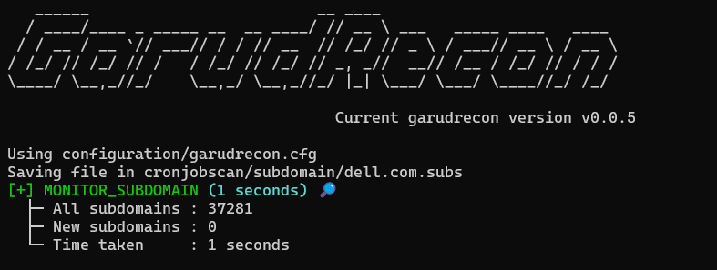
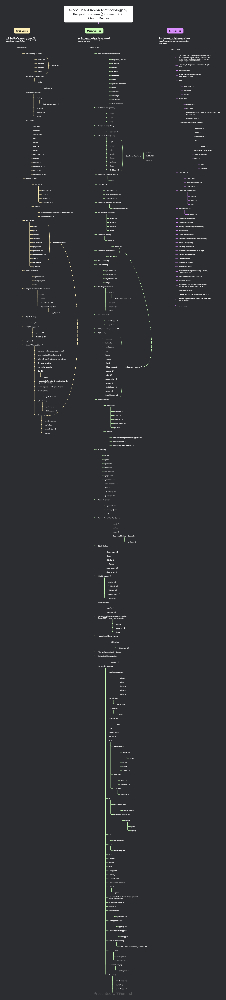

<h1 align="center">
  </a>
</h1>

<p align="center">
<a href="#"></a>
<a href="https://ko-fi.com/rix4uni"></a>
<a href="https://x.com/rix4uni"></a>
<a href="https://github.com/rix4uni/GarudRecon/issues"></a>
<a href="https://github.com/rix4uni/GarudRecon/blob/master/LICENSE"></a>
<a href="#"></a>
<a href="https://github.com/rix4uni?tab=followers"></a>
</p>

## GarudRecon

An automated recon tool for asset discovery and vulnerability scanning using open-source tools. Supports XSS, SQLi, LFI, RCE, IIS, Open Redirect, Swagger UI, .git exposures and more.

## History
I created GarudRecon in 2022 but I deleted because some of api keys leaked here someone forked [GarudRecon](https://github.com/polling-repo-continua/GarudRecon)

After that i tried in python, golang but i did'nt liked "String Concatenation", so i came back to bash again.

### Referral Links

<p align="center">
<a href="https://m.do.co/c/43c704381b79" target="_blank">

</a>
</p>

<p align="center">
<a href="https://login.linode.com/signup" target="_blank">

</a>
</p>

<p align="center">
<a href="https://cloud.ibm.com/docs/overview?topic=overview-tutorial-try-for-free" target="_blank">

</a>
</p>

<p align="center">
<a href="https://aws.com" target="_blank">

</a>
</p>

<p align="center">
<a href="https://azure.com" target="_blank">

</a>
</p>

## Installation

### Docker
```

```

### Easy Install
```
bash <(curl -s https://raw.githubusercontent.com/rix4uni/GarudRecon/main/configure)
```

## Usage

<details>
  <summary><b>garudrecon -h</b></summary>

```
GarudRecon - Recon Automation Framework

GarudRecon is an automated reconnaissance framework designed for asset discovery,
vulnerability detection, and continuous monitoring. It leverages a wide range of
open-source tools to scan domains, collect subdomains, and check for various
vulnerabilities such as:

  • XSS (Cross-Site Scripting)
  • SQLi (SQL Injection)
  • LFI (Local File Inclusion)
  • RCE (Remote Code Execution)
  • IIS misconfigurations
  • Subdomain Takeover
  • Open Redirects
  • Swagger UI exposures
  • .git directory leaks
  • JavaScript secrets and more.

The tool supports scoped recon with flexible modes like smallscope, mediumscope,
and largescope, depending on your coverage needs. You can customize scans,
exclude specific functions, provide configuration files, and automate cron jobs
for continuous monitoring.

Usage:
  garudrecon [command]

Available Commands:
  install                 Set up the tool and dependencies
  smallscope              Run minimal recon for subdomain (e.g. support.domain.com)
  mediumscope             Perform moderate recon with optional vulnerability checks for wildcard domain (e.g. *.domain.com)
  largescope              Full-scale recon for deep visibility for organisation
  cronjobs                Automate recurring recon tasks

Flags:
  -h, --help     help for garudrecon
  -v, --version  Display the current version

Use "garudrecon [command] --help" for more information about a command.
```
</details>


<details>
  <summary><b>garudrecon install -h</b></summary>

```
```
</details>


<details>
  <summary><b>garudrecon smallscope -h</b></summary>

```
```

#### Output

</details>


<details>
  <summary><b>garudrecon mediumscope -h</b></summary>

```
Performs a medium-level reconnaissance on the target domain, typically scoped as *.domain.com. This includes subdomain enumeration, vulnerability checks (like XSS, SQLi, LFI, etc.), and optional filtering of out-of-scope subdomains.

Usage:
  garudrecon mediumscope [flags]

Flags:
  -d, --domain                          Scan a domain (e.g. domain.com)
  -ef, --exclude-functions              Exclude a function from running (e.g. AMASS)
  -rx, --recon-xss                      Run full recon with XSS checks
  -rs, --recon-sqli                     Run full recon with SQLi checks
  -rl, --recon-lfi                      Run full recon with LFI checks
  -rst, --recon-subtakeover             Run full recon with Subdomain Takeover checks
  -rr, --recon-rce                      Run full recon with RCE checks
  -ri, --recon-iis                      Run full recon with IIS checks
  -oos, --outofscope                    Exclude outofscope subdomains from a list (e.g. domain.com.oos)
  -c, --config                          Custom configuration file path
  -h, --help                            help for mediumscope

Example:
# Full recon
  garudrecon mediumscope -d domain.com

# Recon with XSS only
  garudrecon mediumscope -d domain.com -rx

# Recon with SQLi only
  garudrecon mediumscope -d domain.com -rs

# Exclude functions manually
  garudrecon mediumscope -d domain.com -ef "SUBFINDER,AMASS"

# Combined
  garudrecon mediumscope -d domain.com -rx -ef "AMASS"
```

#### Output

</details>


<details>
  <summary><b>garudrecon largescope -h</b></summary>

```
```

#### Output

</details>


<details>
  <summary><b>garudrecon cronjobs -h</b></summary>

```
This command runs scheduled reconnaissance tasks on a specified domain, such as monitoring subdomains, ports, JavaScript files, and live hosts. It supports various monitoring functions and can be customized with configuration files and verbose output.

Usage:
  garudrecon cronjobs [flags]

Flags:
  -d, --domain                  Domain to monitor
  -f, --function                Function to run (e.g. MONITOR_SUBDOMAIN)
  -c, --config                  Custom configuration file path
  -i, --interval                Customize the sleep duration (e.g. 1800)
  -v, --verbose                 enable verbose mode
  -h, --help                    help for cronjobs

Example:
  garudrecon cronjobs -d domain.com -f MONITOR_SUBDOMAIN
  garudrecon cronjobs -d domain.com -f MONITOR_PORTS
  garudrecon cronjobs -d domain.com -f MONITOR_ALIVESUBD
  garudrecon cronjobs -d domain.com -f MONITOR_JS
  garudrecon cronjobs -d domain.com -f MONITOR_JSLEAKS
```

#### Output

</details>


## Demo

## Operating Systems Supported

| OS         | Supported | Easy Install | Tested        |
| ---------- | --------- | ------------ | ------------- |
| Ubuntu     | Yes       | Yes          | Ubuntu 24.04  |
| Kali       | Yes       | Yes          | Kali 2025.2   |
| Debian     | Yes       | Yes          | No		    |
| Windows    | Yes       | Yes          | WSL Ubuntu 	|
| MacOS      | Yes       | Yes          | No    		|
| Arch Linux | Yes       | No           | No            |
|            |           |              |               |

## Change Values According to you systems ram

| NAME                 | 1GB RAM | 2GB RAM | 4GB RAM | 8GB RAM | Description                                                                                |
| -------------------- | ------- | ------- | ------- | ------- | ------------------------------------------------------------------------------------------ |
| IS_U_USING_VPS       | Yes     | Yes     | Yes     | Yes     | If you running this tool on vps change `IS_U_USING_VPS="FALSE" into IS_U_USING_VPS="TRUE"` |
| AMASS                | No      | Yes     | Yes     | Yes     |                                                                                            |
| BBOT                 | No      | Yes     | Yes     | Yes     |                                                                                            |
| FFUFBRUTE            | No      | Yes     | Yes     | Yes     | Got from https://x.com/ArmanSameer95/status/1680811916053078019                            |
| Screenshotting Tools | No      | Yes     | Yes     | Yes     |                                                                                            |
| VULNTECHX            | No      | No      | Yes     | Yes     | Finds Vuln Based on website tech                                                           |
| PYXSS                | No      | Yes     | Yes     | Yes     | Checks XSS False Positive                                                                  |
| GALER                | No      | No      | Yes     | Yes     |                                                                                            |

## Tools

### Subdomain Enumeration
- BugBountyData
- subfinder
- amass
- subdog
- xsubfind3r
- findomain
- chaos
- github-subdomains
- bbot
- oneforall
- shosubgo
- assetfinder
- haktrails
- haktrailsfree
- org2asn
- ipfinder
- ipranges
- arinrange
- spk
- analyticsrelationships
- udon
- builtwithsubs
- whoxysubs

### Certificate Transperency
- kaeferjaeger
- trickestcloud
- cero
- certinfo
- csprecon
- cspfinder
- jsubfinder
- dnsxbrute
- subwiz

### Subdomain Permutations
- altdns
- puredns
- alterx
- gotator
- dnsgen
- goaltdns
- ripgen
- dmut

### Subdomain Resolving
- puredns
- shuffledns
- massdns

### Subdomain DNS Enumeration
- dnsx

### Port Scanning
- naabu
- masscan
- rustscan
- nmap

### Subdomain Probing
- httpx

### Subdomain Bruteforcing
- subdomainfuzz

### VHOST Dicovery
- ffuf

### Favicon Lookup
- favinfo
- favirecon

### Screenshotting
- gowitness
- aquatone
- eyewitness
- httpx

### Directory Enumeration
- ffuf
- dirsearch
- feroxbuster
- wfuzz

### Email Enumeration
- emailfinder

### Url Crawling
- waymore
- hakrawler
- waybackurls
- katana
- gau
- gospider
- uforall
- cariddi
- urlfinder
- github-endpoints
- xurlfind3r
- xcrawl3r
- crawley
- GoLinkFinder
- galer
- gourlex
- pathfinder
- pathcrawler
- roboxtractor
- robotxt

### Google Dorking
- gorker

### JS Crawling
- subjs
- getJS
- jscrawler
- jsfinder
- javascript-deobfuscator
- linkfinder
- xnLinkFinder
- getjswords
- sourcemapper
- linx
- jsluice

### Hidden Parameter
- paramfinder
- msarjun
- x8

### Program Based Wordlist Generator
- cewl
- unfurl
- cook
- pydictor

### Subdomain Takeover
- subzy
- nuclei

### MX Takeover
- mx-takeover

### DNS takeover
- dnstake

### Zone Transfer
- dig

### Vulnerability Scanning
- ftpx
- sshx
- s3scanner
- vulntechx
- pvreplace
- xsschecker
- pyxss
- gosqli
- commix
- goop
- pdftotext
- trufflehog
- secretfinder
- mantra
- shortscan
- linkinspector
- brutespray

## Thanks 🙏
_Thanks for creating awesome tools [Thanks](docs/Thanks.md)_

## Mindmap/Workflow
_See Workflow in different format [Workflow](Workflow)_

<p align="center"> 
<a href="Workflow/Scope-Based-Recon.png" target="_blank"> 

</a>  
</p>
